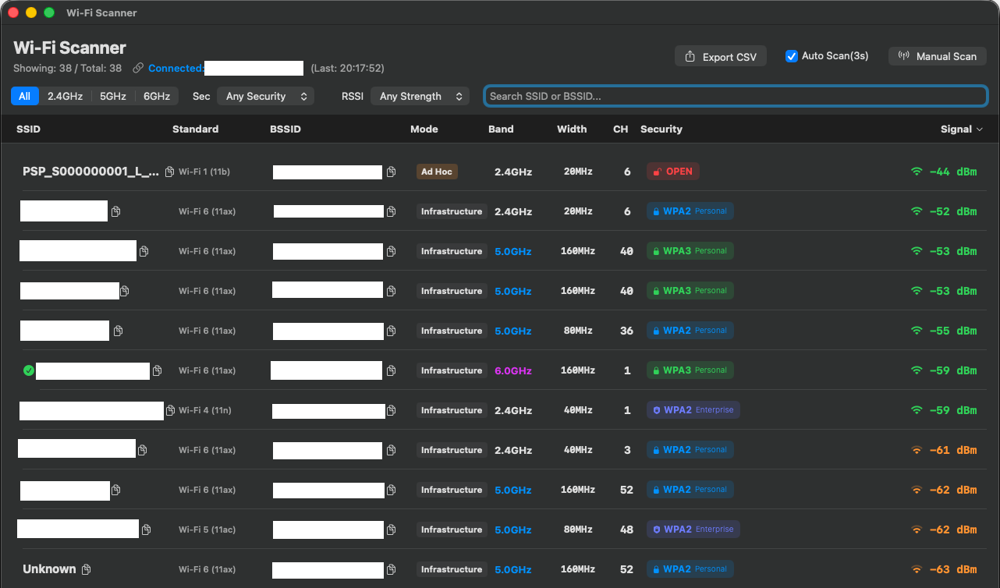

# Wi-Fi Analyzer Pro for macOS 🛜

  

### 🔸 機能 (Japanese)
- **規格の表示**: "Wi-Fi 6 (11ax)" といった表記で、どの規格の無線かを表示
- **認証情報の可視化**: エンタープライズ認証とパーソナル認証を、アイコンと色で判別して表示
- **モード判定**: Infrastructure と Ad Hoc を判定して表示
- **高速フィルタリング**: 周波数帯（2.4G/5G/6G）をセグメントボタンで瞬時に切り替え
- **スマートコピー**: SSIDとBSSIDを1クリックでコピー
- **高度なCSVコピー**: 
    - 1クリックで単品コピー
    - `Cmd + クリック` で複数項目を選択
    - `Cmd + A` で全選択
    - 選択後に `Cmd + C` でデータ一括をCSV形式でコピー
- **CSVエクスポート**: スキャン結果の全量を整理されたCSV形式でファイル出力
- 自動更新:3秒ごとに検索結果を自動更新

### 🔸 Advanced Analysis (English)
- **Standard Display**: Precisely identifies PHY modes such as "Wi-Fi 6 (11ax)" and legacy standards.
- **Authentication Visualizer**: Distinguishes between Enterprise and Personal authentication with dedicated icons.
- **Mode Detection**: Accurately determines Infrastructure and Ad Hoc (IBSS) connections.
- **Band Filtering**: Quick filtering by frequency band (2.4G/5G/6G) via segmented buttons.
- **Smart Copy**: One-click SSID/BSSID copy with visual toast notifications.
- **Advanced Selection**: Support for `Cmd+A` (Select All), `Cmd+Click` (Multi-select), and `Cmd+C` (Copy as CSV).
- **Professional Export**: Export your complete audit logs to a clean CSV file.

### 🔸 インストール方法 / Quick Start
1. Go to the [**Releases**](https://github.com/oppssidsure625/WiFiScanner/releases) page.
2. Download the latest `WiFiScanner_Installer.dmg`.
3. Open the DMG and drag **Wi-Fi Scanner** to your Applications folder.
4. **Note:** Location Services must be enabled to perform Wi-Fi scans (required by macOS Privacy Policy).

---
## 📄 License
This project is licensed under the MIT License.
